## 小米平板2 安裝Google Play商店

國內手機一般是修改 Google 原廠ROM的， 刪減了國內用不了的APK及全部 Google服務。 但 Google 服務的運行環境還在， 只要安裝四個Google play商店相關的APK就可以正常使用。

1. 檢查 Android 版本， 打開“設定” -> "關於平板"， 看到小米平板2是Android 5.1。 


2. 小米平板2的CPU類型是x86_64

3. 因為 Google 沒有x86的設備， 所以找不到有google 原廠ROM來抽取APK；OpenGapps.org的x86_64不能正常運行。最方便是在[APKMirror](http://www.apkmirror.com/)下載。 

>* [Google Services framework](http://www.apkmirror.com/wp-content/themes/APKMirror/download.php?id=95530) ---- 這個APK同android版本相關， 要安裝5.1版本。
>* [Google Account Manager](http://www.apkmirror.com/wp-content/themes/APKMirror/download.php?id=97485)  ---- 這個APK同android版本相關， 要安裝5.X版本。
>* [Google Play Services](http://www.apkmirror.com/wp-content/themes/APKMirror/download.php?id=160923) ---- 這個CPU相關， 要安裝x86_64最新版本的APK。
>* [Google Play Store](http://www.apkmirror.com/wp-content/themes/APKMirror/download.php?id=157402)  ---- 這個限制比較少， 安裝適合DPI的最新版本就可以。
> 
>  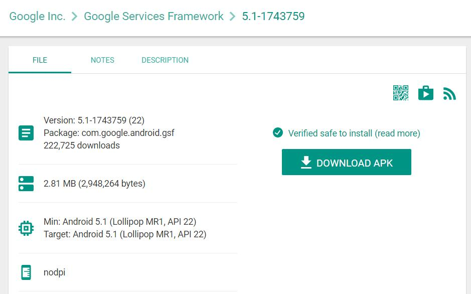 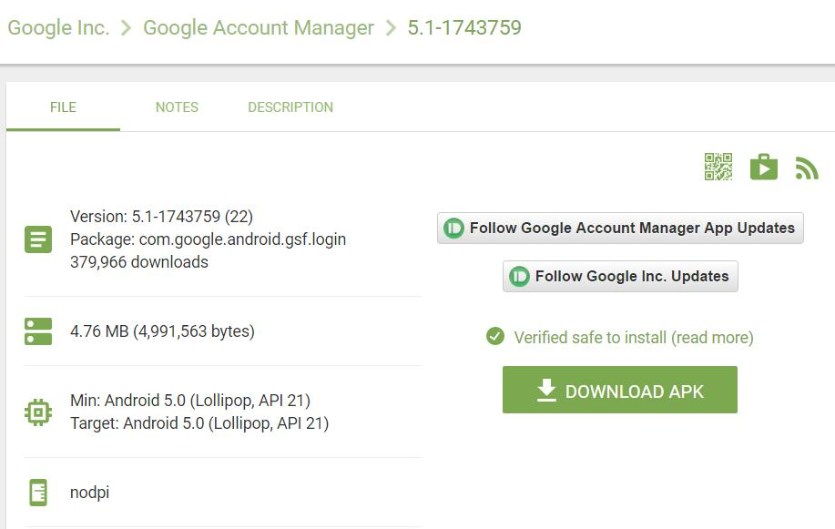 
> 
> 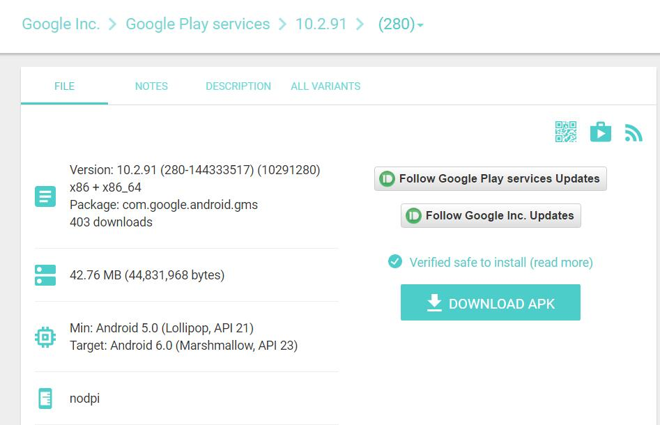 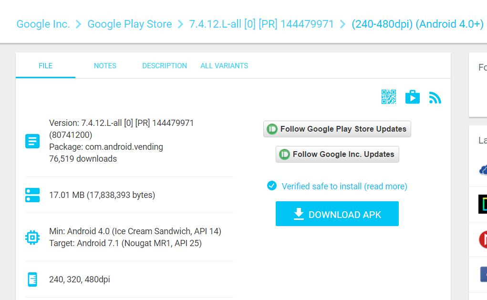 

4. 下載完后， 強烈建議上載去[VirtusTotal](https://virustotal.com/)及[APKPURE](https://apkpure.com/apk-signature-verification)上面檢查一次。


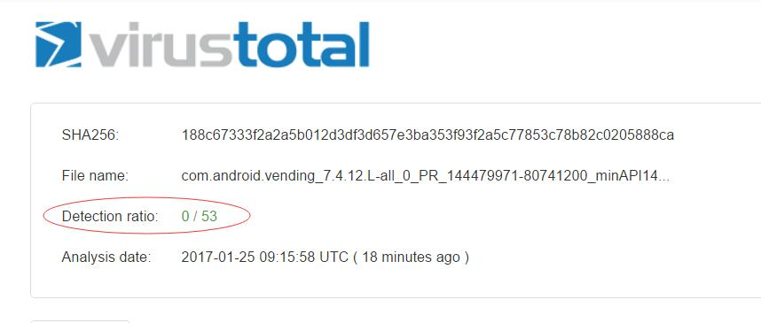 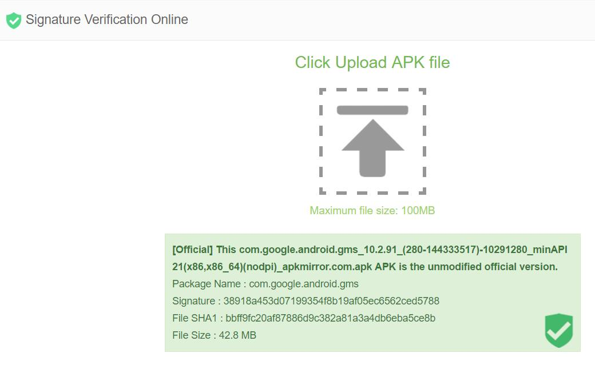 

```
5.x版本的APK在apkpure驗證不過的。 
```

5. 將以上四個APK， 放進小米平板2裡面， 可以直接在小米平板2下載，或者用遠程文件管理擺進去。 將四個APK安裝一次， 但不要運行。

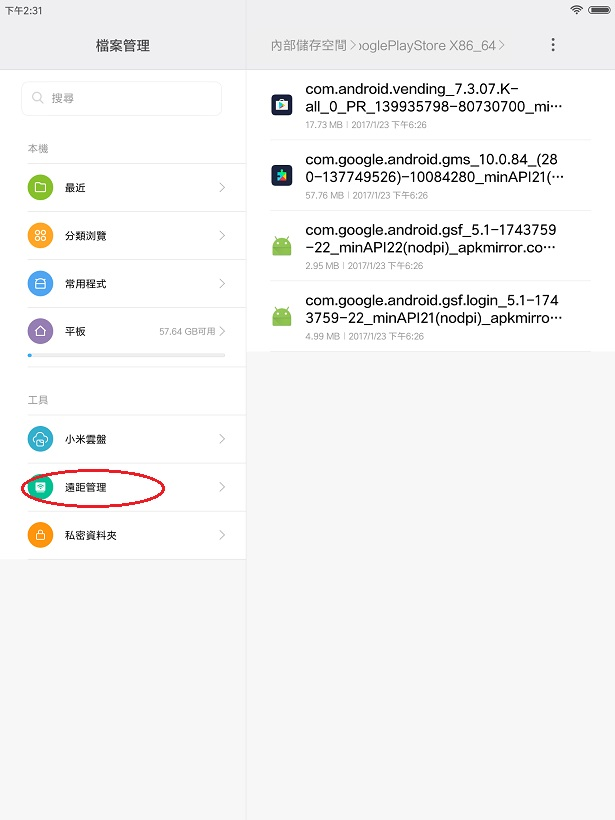 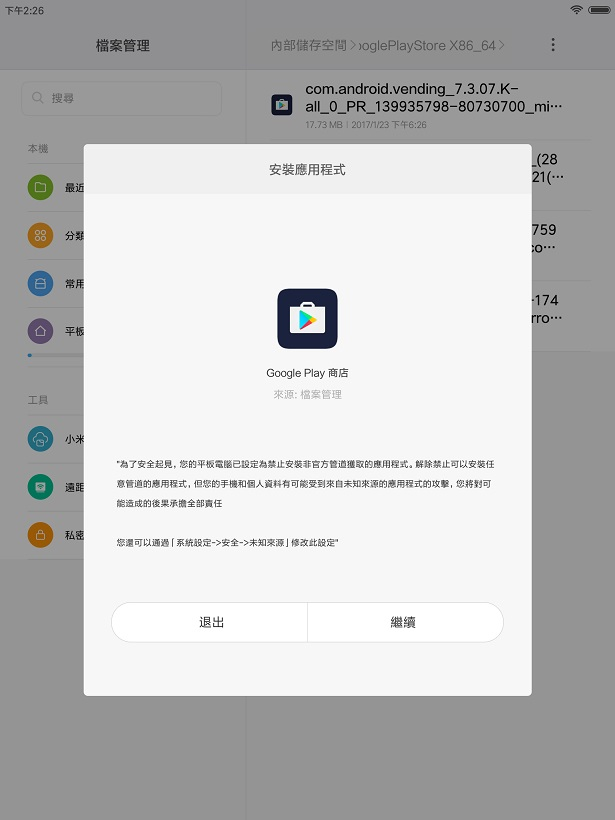 

6. 安裝完后， 設這四個APP自動運行， 然後**重啟兩次**。

 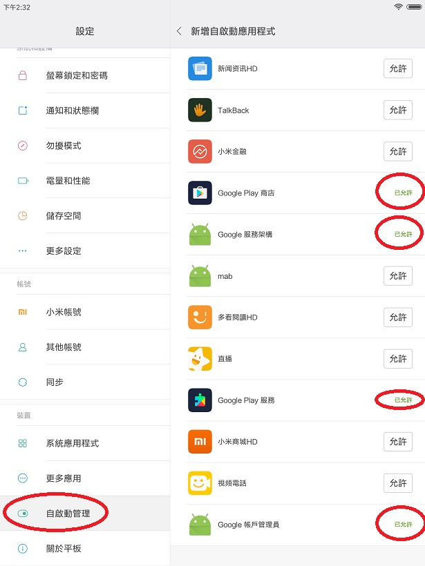 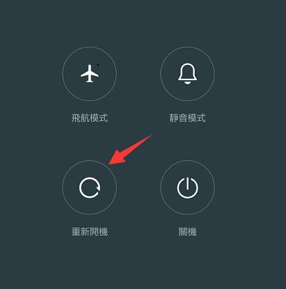

7. 在桌面找到Play商店圖標運行。 

  

8. 如果出現新增賬戶的畫面， 恭喜你， 你已經成功安裝Google Play商店.

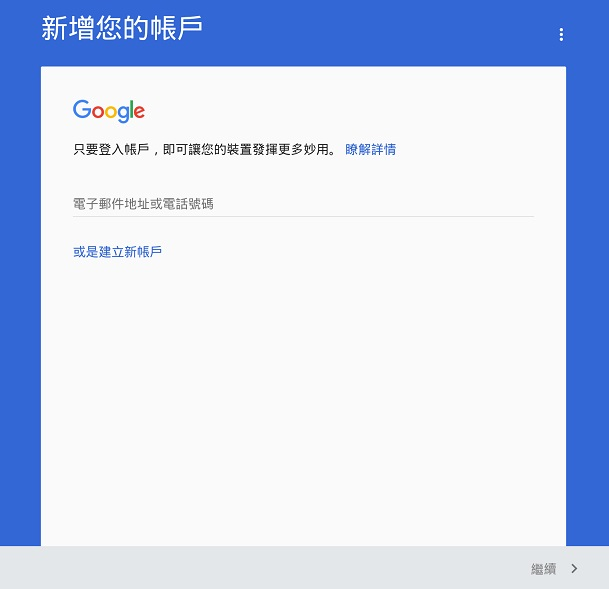 

9. 成功使用后， 可以將自動啟動取消。 

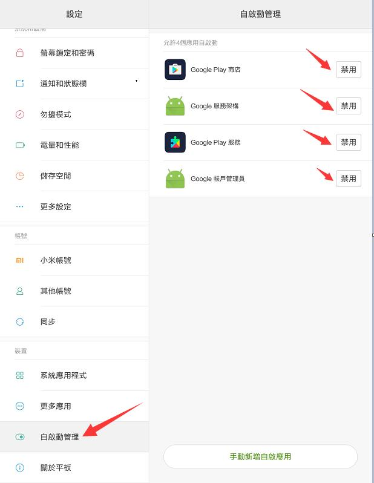 

```
**如果按Play商店圖標沒反應， 只要長按這個圖標刪除，再安裝一次就可以。 **
```


