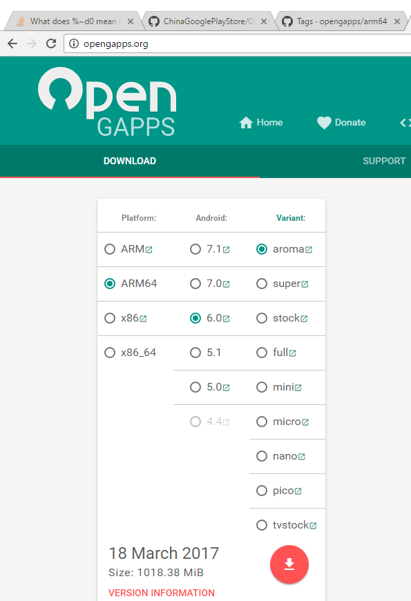
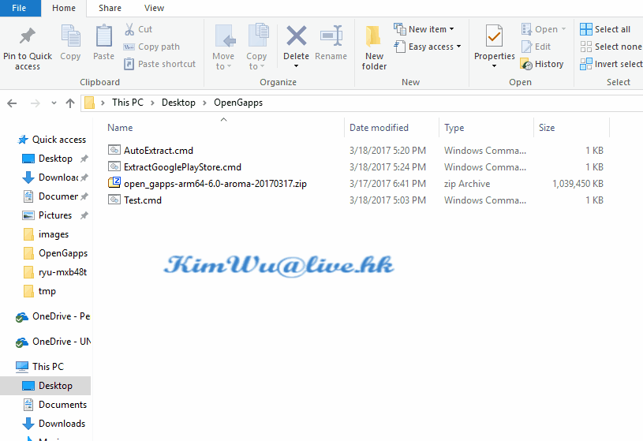

## 從OpenGapps抽取Google Play Store

1. 下載抽取Google Play Store [腳本(按這裡下載)](https://github.com/hkKimWu/ChinaGooglePlayStore/raw/master/OpenGapps/ExtractGooglePlayStoreScripts.zip) , 解開到一個文件夾裡面.
2. 去 OpenGapps.org 下載適合版本的aroma包, 擺放在同一個文件夾.
  
3. 按兩下 **AutoExtract.cmd** 運行, 自動生成 **PlayStore-YYYYMMDD.zip**.
  
4. 將 **PlayStore-YYYYMMDD.zip** 擺到手裡, 解開安裝. 安裝時**不能選運行**, 只能選完成.

5. 將安裝的幾個Google服務,全部設為自動運行, 然後重啟一次手機.

6. 安裝完成, 可以使用google play store.

*注意, 請先安裝7-zip, 64位系統請安裝64位的7-zip, 使用默認的安裝路徑.
